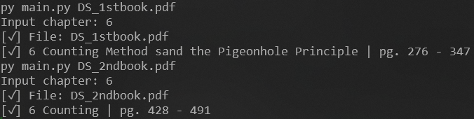

# chaprange
A small command-line program that looks up a chapter's start and end page in a PDF by reading its embedded table of contents.

## Requirements
- Python 
- [PyMuPDF](https://pymupdf.readthedocs.io/en/latest/)

## Installation
```bash
pip install pymupdf
```

## How to Use
Place the PDF in the same folder as 'main.py', then run:
```bash
python main.py book-title.pdf
```

You'll be prompted to enter a chapter number.

## Important Notes
- The PDF must have a table of contents embedded. Scanned PDFs without one may not work.
- Chapter numbers are matched by the digits in the TOC entry title.
- File names are case-sensitive.

## Pictures

